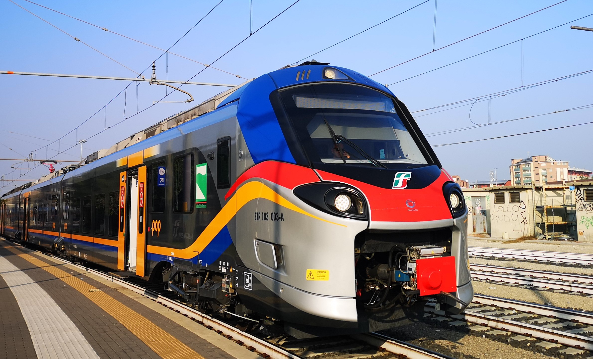
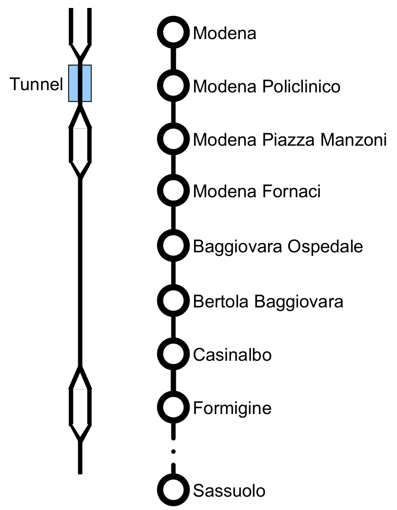

# Precise Railway Localization
## Experiment description
This repository contains the datasets acquired by ETH-PBL in conjunction with Unibo and SADEL during two days of testing in October 2022 near Modena, Italy.

The data was acquired using two sensor nodes developed by ETH Zurich running a [STM32L452CEU6](https://www.st.com/en/microcontrollers-microprocessors/stm32l452ce.html) MCU.  
Each node collected data on the motion of the train using a [ST ASM330LHH](https://www.st.com/en/mems-and-sensors/asm330lhh.html) automotive grade IMU as well as a [u-blox ZED-F9P](https://www.u-blox.com/en/product/zed-f9p-module) GNSS module fed with live RTCM-data from a close by RTK base station provided by SADEL. The base station utilized another ZED-F9P GNSS module in connected to an RaspberryPi which transmitted the generated RTCM correction packages over a raw TCP socket.   
The data was then received using a [u-blox SARA-R4](https://www.u-blox.com/en/product/sara-r4-series) cellular network module.

Fig: The Sensor Node as deployed in the final test run where: (A) SARA-R410M
cellular module, (B) ZED-F9P GNSS module, (C) STM32L452CEU MCU, (D)
microSD card, (E) ASM330LHH IMU

Courtesy of Trenitalia we were able to access the drivers cabin of an ETR103 passenger train, commuting between Modena and Formigine in Italy totaling 6 runs in two days.  

The track was chosen as it exposes a variety of interesting GNSS environments.
Encountered environments are ranging from urban over suburban to open field environments as well as one tunnel.
Due to this composition the availability of cellular connection and thus RTK correction data was patchy but mostly stable.

The two sensor nodes were fixed to the Train Chassis, one centered in the train the other positioned on the left side in driving orientation. 

| Board  | Position wrt travel | GNSS Antenna         | 
|--------|---------------------|----------------------|
| Node 1 | Center              | TOPGNSS TOP106 L1/L2 |
| Node 2 | Left                | ANN-MB-00 L1/L2      | 

Node 1 was placed on the floor in front of the the drivers seat and positioned to be aligned with the center of the train in the lateral direction.
A TOPGNSS TOP106 L1/L2 multi-band antenna was placed below the rear facing windscreen also aligned with the same axis.

Node 2 was mounted on a window on the left side of the train when facing in the direction of travel. This is approximately 1m above the floor and 1.4m left to the lateral center of the train.
An ANN-MB00 L1/L2 antenna was attached to the outside frame of the train above the window.

## Data format

The recorded data is formatted as CSV in the format `TIMESTAMP,DATA_TYPE,DATA`.  

### Timestamp
The timestamp field contains the `[h]:mm:ss.000000` starting at the startup of the board.  
This data is acquired using the onboard real time clock and thus drifts by about 1% compared to the GNSS timestamps.  

### Data type
* `I` - IMU Data  
    The `DATA` contains the encoded concatenation of the accelerometer and gyroscope values.  
    The 12 bytes in any IMU point consist of the the values for Gyroscope X, Y, Z and accelerometer X, Y, Z in this order. Each value is a two byte, twos compliment encoded integer.  
    Example:
    | 0101  | 7dfe  | 69ff  | 43fd  | fcfe  | e240  |
    |-------|-------|-------|-------|-------|-------|
    | Gyr X | Gyr Y | Gyr Z | Acc X | Acc Y | Acc Z |
* `U` GNSS Data  
    The `DATA` in this entry is encoded using the UBX Protocol (as descibed [here in chapter 3](https://content.u-blox.com/sites/default/files/documents/u-blox-F9-HPG-1.32_InterfaceDescription_UBX-22008968.pdf)).  
    The data for day 1 only include `UBX-NAV-PVT` messages, where as day 2 also includes `UBX-NAV-COV`
* `BRK` Custom Breakpoints / Events  
    Breakpoints were introduced to be able to record specific events.  
    There are two different types of events contained in this data set:
    - `RTCM CONNECTED`  
        This event was triggered as soon as the node received the first valid RTCM package
        after being disconnected.
    - `SARA DISCONNECTED`  
        This event was triggered when ever the watchdog guarding the SARA connection timed out (after approximatly 10s).  
        Thus this even describes the failure of collecting RTCM data for 10 seconds. The next valid RTCM is only available after a `RTCM CONNECTED` event. 
* `ARR` Arrival at a station  
    There breakpoints rely on manual user intervention.  
    They were introduced whenever the train arrived at a station.  
    The station name is given in the `DATA` field.
* `DEP` Departure from a station  
    There breakpoints rely on manual user intervention.  
    They were introduced whenever the train started to depart from a station.  
    The station name is given in the `DATA` field.

# Folder structure
The published data is available in the `data` subfolder.
In this folder there exists a subfolder for each collected dataset.
The naming scheme of these subfolders is `yyyyMMDD_HHMM_TrainNr_StartStation_NodeNr`.
The date specified is the date of recording where as the time given does not necessarily correspond to the start of the recording but rather to the planned departure time of the train.
For example `20221020_1252_R90120_Formigine_SN1` will contain the dataset recorded on the 20th of October 2022 onboard of train R90120 scheduled departure 1252. The train is traveling from Formigine to Modena and the dataset was recorded using Sensor Node 1.

Each folder contains a `.csv` file containing the raw recorded data as well as a `Readme.md` containing a preliminary analysis of different metrics regarding the given data such as runtime, GNSS availability, etc. 
