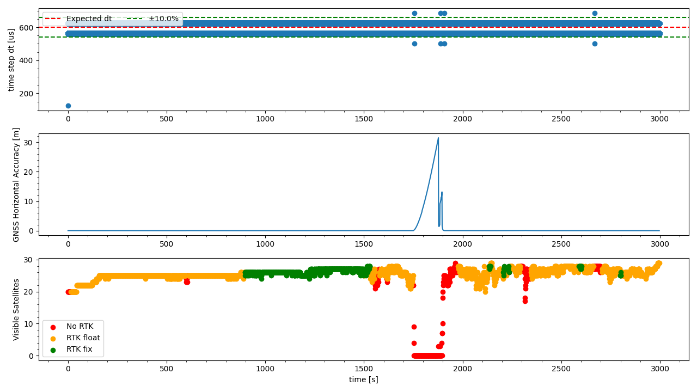

`20221019_1217_R90121_Modena_SN1.csv`
----
|                         |                          |
| ----------------------- | ------------------------ |
| Sensor node             | Sensor node 1            |
| Direction               | Modena -> Formigine      |
| Train Nr.               | R90121                   |
| Planned Depature        | 2022-10-19 12:17:00 CEST |
| First GNSS timestamp    | 2022-10-19 11:53:30 CEST |
| Last GNSS timestamp     | 2022-10-19 12:43:36 CEST |
| Data corruptions        | 0                        |
| Data points             | 5055658                  |
| PVT datapoints          | 3007                     |
| Covariance datapoints   | 0                        |
| Runtime RTC/GNSS        | 2996.68 / 3006.00 s      |
| IMU dt Outliers         | 9                        |
| IMU dt points           | 5052624                  |
| IMU dt error rate       | 1.78ppm                  |
| RTK coverage            | 87.23%                   |
| Sat. coverage (numSv>5) | 95.21117392750249%       |
| Included Breakpoints    | 27                       |
| Included Stations       | 8                        |

