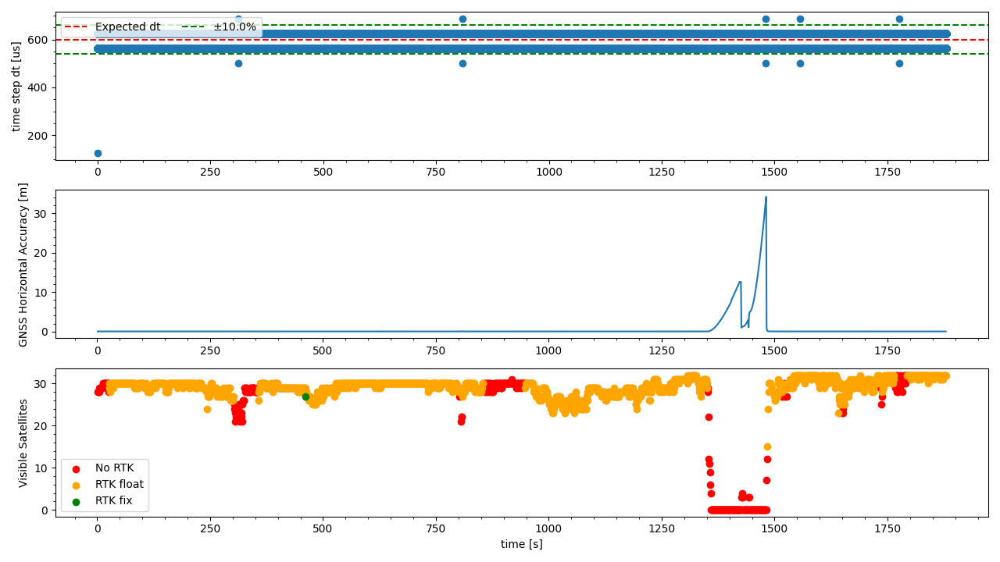

`20221019_1252_R90120_Formigine_SN1.csv`
----
|                         |                          |
| ----------------------- | ------------------------ |
| Sensor node             | Sensor node 1            |
| Direction               | Formigine -> Modena      |
| Train Nr.               | R90120                   |
| Planned Depature        | 2022-10-19 12:52:00 CEST |
| First GNSS timestamp    | 2022-10-19 12:50:51 CEST |
| Last GNSS timestamp     | 2022-10-19 13:22:15 CEST |
| Data corruptions        | 0                        |
| Data points             | 3169522                  |
| PVT datapoints          | 1885                     |
| Covariance datapoints   | 0                        |
| Runtime RTC/GNSS        | 1879.22 / 1884.00 s      |
| IMU dt Outliers         | 11                       |
| IMU dt points           | 3167606                  |
| IMU dt error rate       | 3.47ppm                  |
| RTK coverage            | 80.90%                   |
| Sat. coverage (numSv>5) | 93.42%                   |
| Included Breakpoints    | 27                       |
| Included Stations       | 8                        |

