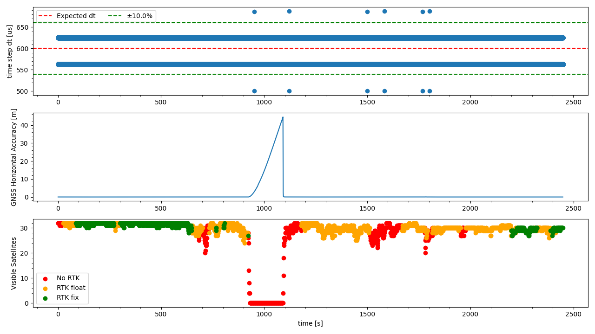

`20221019_1345_R90125_Modena_SN1.csv`
----
|                         |                          |
| ----------------------- | ------------------------ |
| Sensor node             | Sensor node 1            |
| Direction               | Modena -> Formigine      |
| Train Nr.               | R90125                   |
| Planned Depature        | 2022-10-19 13:45:00 CEST |
| First GNSS timestamp    | 2022-10-19 13:35:09 CEST |
| Last GNSS timestamp     | 2022-10-19 14:16:06 CEST |
| Data corruptions        | 0                        |
| Data points             | 4131951                  |
| PVT datapoints          | 2457                     |
| Covariance datapoints   | 0                        |
| Runtime RTC/GNSS        | 2448.85 / 2456.00 s      |
| IMU dt Outliers         | 12                       |
| IMU dt points           | 4129462                  |
| IMU dt error rate       | 2.91ppm                  |
| RTK coverage            | 78.27%                   |
| Sat. coverage (numSv>5) | 93.24%                   |
| Included Breakpoints    | 29                       |
| Included Stations       | 8                        |

