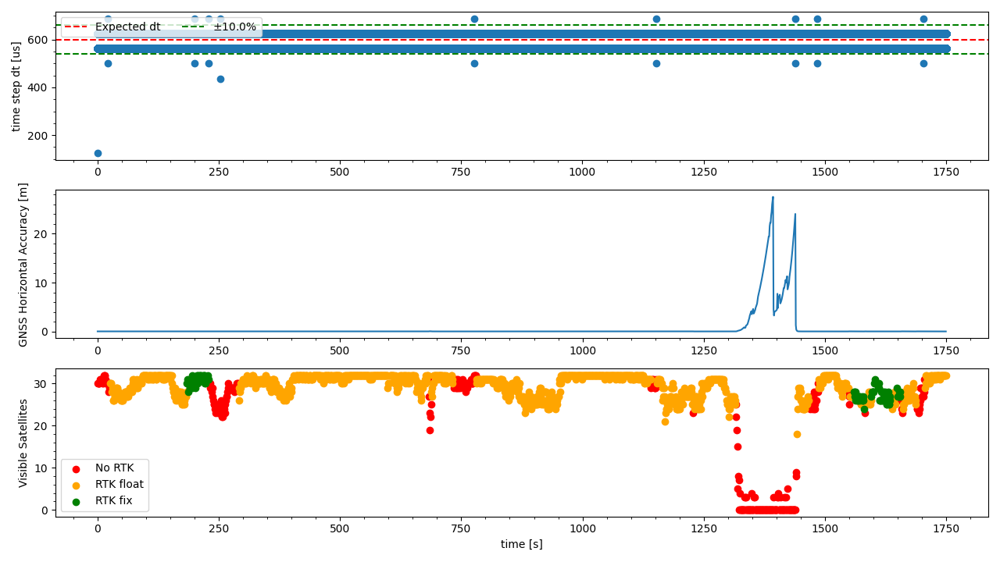

`20221019_1422_R90124_Formigine_SN1.csv`
----
|                         |                          |
| ----------------------- | ------------------------ |
| Sensor node             | Sensor node 1            |
| Direction               | Formigine -> Modena      |
| Train Nr.               | R90124                   |
| Planned Depature        | 2022-10-19 14:22:00 CEST |
| First GNSS timestamp    | 2022-10-19 14:22:28 CEST |
| Last GNSS timestamp     | 2022-10-19 14:51:41 CEST |
| Data corruptions        | 1                        |
| Data points             | 2949510                  |
| PVT datapoints          | 1754                     |
| Covariance datapoints   | 0                        |
| Runtime RTC/GNSS        | 1749.12 / 1753.00 s      |
| IMU dt Outliers         | 19                       |
| IMU dt points           | 2947722                  |
| IMU dt error rate       | 6.45ppm                  |
| RTK coverage            | 81.13%                   |
| Sat. coverage (numSv>5) | 93.27%                   |
| Included Breakpoints    | 30                       |
| Included Stations       | 7                        |

