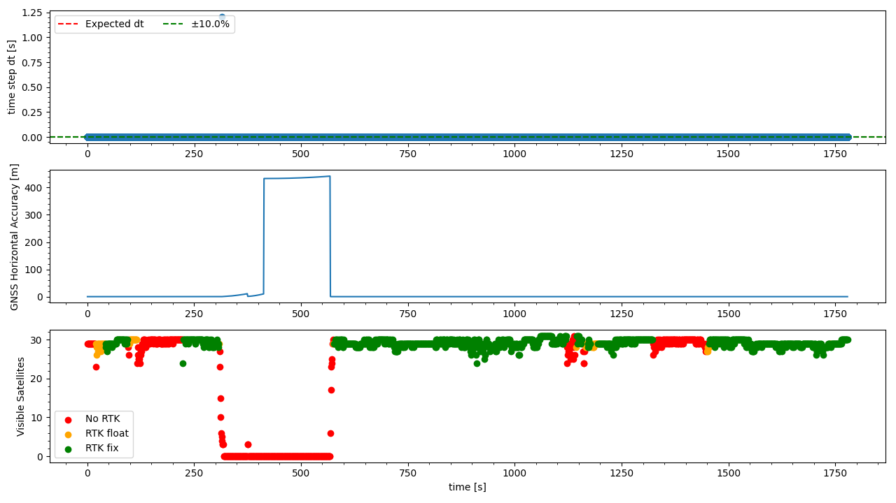

`20221020_1030_R90117_Modena_SN2.csv`
----
|                         |                          |
| ----------------------- | ------------------------ |
| Sensor node             | Sensor node 2            |
| Direction               | Modena -> Formigine      |
| Train Nr.               | R90117                   |
| Planned Depature        | 2022-10-20 10:30:00 CEST |
| First GNSS timestamp    | 2022-10-20 10:30:23 CEST |
| Last GNSS timestamp     | 2022-10-20 10:59:58 CEST |
| Data corruptions        | 0                        |
| Data points             | 3019460                  |
| PVT datapoints          | 1776                     |
| Covariance datapoints   | 1776                     |
| Runtime RTC/GNSS        | 1778.96 / 1775.00 s      |
| IMU dt Outliers         | 29                       |
| IMU dt points           | 3015871                  |
| IMU dt error rate       | 9.62ppm                  |
| RTK coverage            | 68.86%                   |
| Sat. coverage (numSv>5) | 85.70%                   |
| Included Breakpoints    | 33                       |
| Included Stations       | 8                        |

