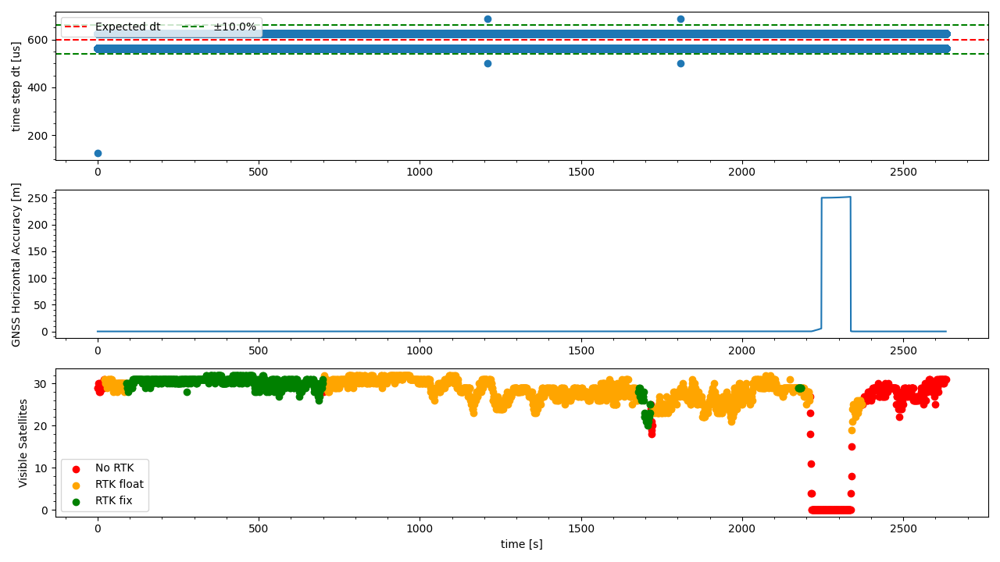

`20221020_1122_R90116_Formigine_SN1.csv`
----
|                         |                          |
| ----------------------- | ------------------------ |
| Sensor node             | Sensor node 1            |
| Direction               | Formigine -> Modena      |
| Train Nr.               | R90116                   |
| Planned Depature        | 2022-10-20 11:22:00 CEST |
| First GNSS timestamp    | 2022-10-20 11:06:05 CEST |
| Last GNSS timestamp     | 2022-10-20 11:50:06 CEST |
| Data corruptions        | 0                        |
| Data points             | 4445906                  |
| PVT datapoints          | 2643                     |
| Covariance datapoints   | 2643                     |
| Runtime RTC/GNSS        | 2632.48 / 2642.00 s      |
| IMU dt Outliers         | 5                        |
| IMU dt points           | 4440591                  |
| IMU dt error rate       | 1.13ppm                  |
| RTK coverage            | 84.03%                   |
| Sat. coverage (numSv>5) | 95.27%                   |
| Included Breakpoints    | 20                       |
| Included Stations       | 8                        |

