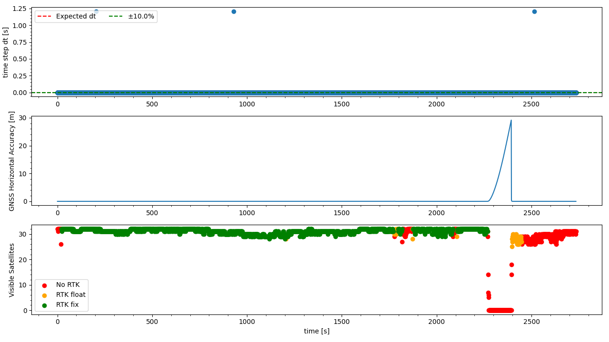

`20221020_1122_R90116_Formigine_SN2.csv`
----
|                         |                          |
| ----------------------- | ------------------------ |
| Sensor node             | Sensor node 2            |
| Direction               | Formigine -> Modena      |
| Train Nr.               | R90116                   |
| Planned Depature        | 2022-10-20 11:22:00 CEST |
| First GNSS timestamp    | 2022-10-20 11:05:18 CEST |
| Last GNSS timestamp     | 2022-10-20 11:50:48 CEST |
| Data corruptions        | 0                        |
| Data points             | 4637320                  |
| PVT datapoints          | 2730                     |
| Covariance datapoints   | 2730                     |
| Runtime RTC/GNSS        | 2734.57 / 2729.00 s      |
| IMU dt Outliers         | 30                       |
| IMU dt points           | 4631822                  |
| IMU dt error rate       | 6.48ppm                  |
| RTK coverage            | 81.06%                   |
| Sat. coverage (numSv>5) | 95.60%                   |
| Included Breakpoints    | 34                       |
| Included Stations       | 8                        |

