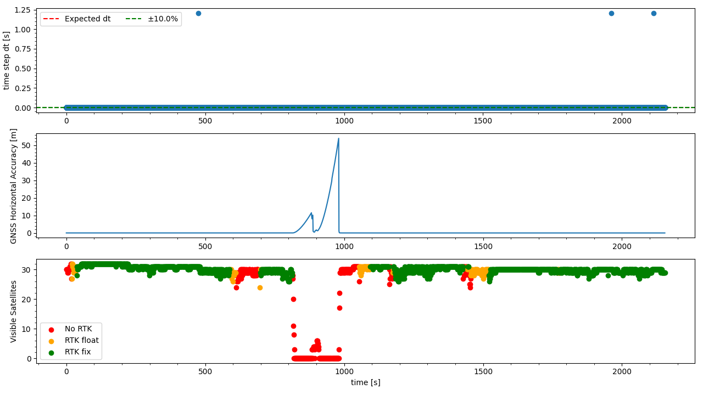

`20221020_1217_R90121_Modena_SN2.csv`
----
|                         |                          |
| ----------------------- | ------------------------ |
| Sensor node             | Sensor node 2            |
| Direction               | Modena -> Formigine      |
| Train Nr.               | R90121                   |
| Planned Depature        | 2022-10-20 12:17:00 CEST |
| First GNSS timestamp    | 2022-10-20 12:09:21 CEST |
| Last GNSS timestamp     | 2022-10-20 12:45:14 CEST |
| Data corruptions        | 0                        |
| Data points             | 3657509                  |
| PVT datapoints          | 2154                     |
| Covariance datapoints   | 2154                     |
| Runtime RTC/GNSS        | 2155.14 / 2153.00 s      |
| IMU dt Outliers         | 38                       |
| IMU dt points           | 3653164                  |
| IMU dt error rate       | 10.40ppm                 |
| RTK coverage            | 82.03%                   |
| Sat. coverage (numSv>5) | 92.57%                   |
| Included Breakpoints    | 37                       |
| Included Stations       | 8                        |

