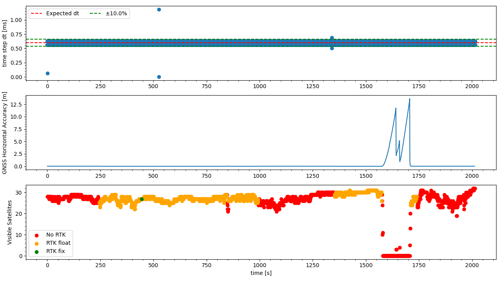

`20221020_1252_R90120_Formigine_SN1.csv`
----
|                         |                          |
| ----------------------- | ------------------------ |
| Sensor node             | Sensor node 1            |
| Direction               | Formigine -> Modena      |
| Train Nr.               | R90120                   |
| Planned Depature        | 2022-10-20 12:52:00 CEST |
| First GNSS timestamp    | 2022-10-20 12:50:27 CEST |
| Last GNSS timestamp     | 2022-10-20 13:24:04 CEST |
| Data corruptions        | 1                        |
| Data points             | 3395964                  |
| PVT datapoints          | 2018                     |
| Covariance datapoints   | 2018                     |
| Runtime RTC/GNSS        | 2013.08 / 2017.00 s      |
| IMU dt Outliers         | 5                        |
| IMU dt points           | 3391901                  |
| IMU dt error rate       | 1.47ppm                  |
| RTK coverage            | 49.50%                   |
| Sat. coverage (numSv>5) | 93.66%                   |
| Included Breakpoints    | 23                       |
| Included Stations       | 8                        |

