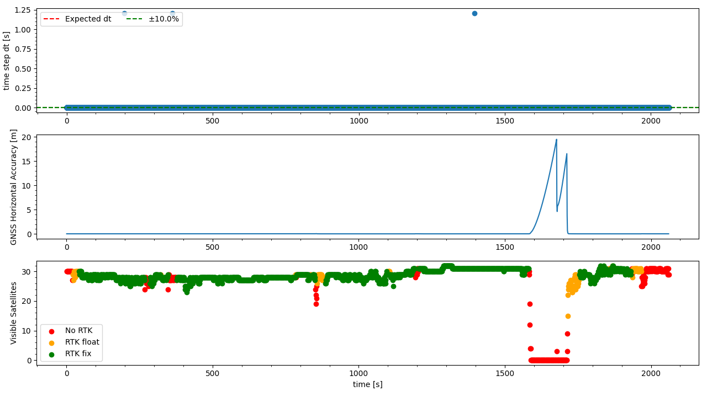

`20221020_1252_R90120_Formigine_SN2.csv`
----
|                         |                          |
| ----------------------- | ------------------------ |
| Sensor node             | Sensor node 2            |
| Direction               | Formigine -> Modena      |
| Train Nr.               | R90120                   |
| Planned Depature        | 2022-10-20 12:52:00 CEST |
| First GNSS timestamp    | 2022-10-20 12:50:25 CEST |
| Last GNSS timestamp     | 2022-10-20 13:24:43 CEST |
| Data corruptions        | 0                        |
| Data points             | 3493972                  |
| PVT datapoints          | 2058                     |
| Covariance datapoints   | 2058                     |
| Runtime RTC/GNSS        | 2060.30 / 2057.00 s      |
| IMU dt Outliers         | 38                       |
| IMU dt points           | 3489813                  |
| IMU dt error rate       | 10.89ppm                 |
| RTK coverage            | 84.40%                   |
| Sat. coverage (numSv>5) | 93.82896015549078%       |
| Included Breakpoints    | 39                       |
| Included Stations       | 8                        |

